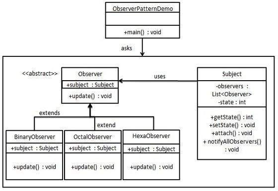

# Design Patterns

> 인터페이스란?     
인터페이스는 객체 간 의사소통하는 근본적인 방법을 정의한다.     
서로 다른 클래스들이 상호작용하기 위해 외부로 노출되어 다른 클래스에게 제공될 수 있는 기능을 명세한것이 인터페이스이다.     
즉 인터페이스만으로 해당 클래스가 어떤 기능을 제공하는지 알 수 있다.     
인터페이스는 기능 명세만 하고, 이에 대한 구현은 인터페이스를 구현한 클래스에서 하기 때문에, 기능 명세와 구현을 분리 할 수 있다.

-----

> 알고리즘이란?
"주어진 문제를 해결하기 위한 단게, 절차 또는 여러 동작의 모임"     
어떠한 문제를 해결하기 위해 정해진 일련의 절차나 방법을 공식화한 형태로 표현한 것, 계산을 실행하기 위한 단계적 절차를 의미한다.     
절차에는 입력값과 출력값이 존재해야하며, 유한한 단계를 거쳐서 반드시 종료되어야한다.

-----

> class 개념
```js
// 클래스 선언문
class Person {
  x = 1; // 클래스 필드
  #y = 0; // Private 필드
  static x1 = 20; // Static public field
  static #y1 = 20;  // Static private field
  // constructor(생성자)
  constructor(name){ 
    this.name = name;
  }
  print(){
    console.log(`Hi ${this.name}`);
  }
  call(){
    this.#y = 10;
    return this.#y;
  }
}
// 인스턴스 생성
const person = new Person('Park');
person.print(); // Hi Park
console.log(person instanceof Person) // true;

console.log(person.x) // 1
console.log(person.#y) // SyntaxError: Undefined private field #y: must be declared in an enclosing class
console.log(person.x1) // 20;
console.log(person.#y1) // SyntaxError: Undefined private field #y1: must be declared in an enclosing class
console.log(person.call()) // 10;
```

-----

## 1. Singleton Patterns 싱글톤 패턴
특정 클래스에 대해 new 연산자로 생성되는 인스턴스를 Stack 스택 메모리에 한 번만 할당하여     
이후에 new 연산자를 통한 객체 생성 요구에 대해서는 최초에 생성되었던 객체를 반환하는 디자인 패턴입니다.     
즉 특정 클래스에 대한 유일 객체를 보장하는 패턴이라고 볼 수 있다.     
싱글톤 패턴으로 적용된 경우 new 사용을 통한 무분별한 인스턴스 생성을 막기 때문에 메모리 낭비를 방지 할 수 있다.     
     
인스턴스가 오직 하나만 생성되어야 하는 케이스에 사용되는 패턴이다.

```ts
class Singleton {
  private data : number = 10;
  private static instance: Singleton;
  public static getInstance() : Singleton {
    if(!Singleton.instance){
      Singleton.instance = new Singleton();
    }
    return this.instance;
  }
  public setData(data: number): void {
    this.data = data;
  }
  public getData() : number {
    return this.data;
  }
}
```

인스턴스를 처음부터 생성하는 방법
```ts
class Singleton {
  private static instance : Singleton = new Singleton();
  public static getInstance() : Singleton {
    return this.instance
  }
}
```

`private static instance: Singleton;` 생성자의 경우 private로 선언 하면서 외부에서는 new 사용을 막고있다.     
인스턴스를 생성하기 위해서는 `getInstance()`를 사용하여 `instance`가 null일 경우에만 new 연산자로 인스턴스를 생성하게 됩니다. 즉, 한번 인스턴스가 생성 된 후에는 계속해서 같은 인스턴스만 반환하게 되는 겁니다.

```ts

class SingletonMain {
  static instance1: Singleton;
  static instance2: Singleton;
  static instance3: Singleton;
  public static main(){
    this.instance1 = Singleton.getInstance();
    this.instance2 = Singleton.getInstance();
    this.instance3 = Singleton.getInstance();

    console.log('instance1: ' + this.instance1.getData())
    console.log('instance2: ' + this.instance2.getData())
    console.log('instance3: ' + this.instance3.getData())

    this.instance1.setData(50);

    console.log('instance1: ' + this.instance1.getData())
    console.log('instance2: ' + this.instance2.getData())
    console.log('instance3: ' + this.instance3.getData())
  }
}
SingletonMain.main();
```

`getInstance()`를 통해 3개의 인스턴스를 생성하고 있다.     
싱글톤 패턴이 제대로 적용되었다면 3개의 인스턴스가 모두 같은 *인스턴스* 일 것이다.

-----

## 2. Strategy Pattern 전략패턴
알고리즘의 인터페이스를 정의하고, 각각의 알고리즘은 캡슐화하여 동적으로 교체사용 가능하도록 구현하는 디자인 패턴이다.     
클라이언트와의 독립적으로 구현되기 때문에 새로운 알고리즘을 추가하거나 기존의 알고리즘을 쉽게 변경이 가능하다.     

     

* Context - 실제 각각의 알고리즘에 대한 인스턴스를 가짐
* Interface - 각각의 알고리즘이 가져야 할 공통인터페이스를 가짐
* Algorithm1, Algorithm2 - 실제 인터페이스 구현, 각각의 알고리즘을 프로그래밍 (전략개체)

1. Interface
```ts
interface PersonInterface {
  action() : void;
}
```

`PersonInterface`는 전략구조 중에서 `Interface`에 해당된다. 알고리즘들의 공통적으로 정의해야 할 인터페이스를 정의한다.    
즉 각각의 알고리즘은 `action()` 메서드에 대해서 구현을 해야한다.

2. Context
```ts
class Person {
  private person: PersonInterface;
  constructor(person: PersonInterface){
    this.person = person;
  }
  public action() : void {
    this.person.action();
  }
  public changeAction(person: PersonInterface) {
    this.person = person;
  }
}
```
`Person`은 `Context`에 해당된다.     
실제로 각각 알고리즘의 인스턴스를 가지며 인터페이스와 동일한 메서드를 호출한다.

3. Algorithm
```ts
class JumpPerson implements PersonInterface {
  public action() : void {
    console.log('Jump !!')
  }
}

class RunPerson implements PersonInterface {
  public action() : void {
    console.log('Run !!')
  }
}
```
인터페이스를 상속받아 실제로 알고리즘 내용을 구현한다.     
`implements` 인터페이스 구현 / 부모 (PersonInterface) 객체는 선언만 하며 정의(내용)은 자식(JumpPerson, RunPerson) 에서 오버라이딩(재정의)해서 사용해야함

4. Strategy
```ts
class Memory {
  person1: Person;
  person2: Person;
  constructor(){
    this.person1 = new Person(new JumpPerson());
    this.person2 = new Person(new RunPerson());

    this.person1.action();
    this.person2.action();

    // person1 객체에 대한 알고리즘을 쉽게 변경 할 수 있다.
    this.person1.changeAction(new RunPerson());
    this.person1.action();
  }
}
```

### 2-1. 패턴 적용 예제
> 적용 코드는 디렉토리 ./assets/ts/strategy.ts 확인하기

**[적용 예제 참고 링크]**[https://gdtbgl93.tistory.com/6?category=755764]

### 2-2. *전략 패턴 적용 하기 전 문제점*      
      

위 패턴은 _Chicken_ 클래스를 _GarlicChicken_, _SpicyChicken_, _FriedChicken_ 에 상속해서 치킨요리와, 치킨 맛, 치킨 모양새에 대해 정의하고 있다. 지금 3가지 치킨의 요리 방식이 **튀기는 방식 (fried(): void)** 으로 동일하지만, 만약 튀기는 방식이 아닌 **굽는 방식** 의 치킨 신메뉴가 추가된다면, _Chicken_ 클래스에 굽는 메소드를 추가하여 새 메뉴 클래스에 호출할 것이다.     

요리 방식의 종류가 늘어나면 _Chicken_ 클래스에 메서드가 점점 추가되고, 사용하지 않은 메서드가 메모리만 차지하게 된다.     
크게 달라지는 부분이 *요리 방식* 이기 때문에, 방식을 클래스로 캡슐화 하여 각 치킨 클래스에서 필요한 방식의 메서드만 사용해서 메모리 최적화를 할 수 있고, 요리 방식의 수정 사항이 생기면 캡슐화 한 클래스 메서드만 수정하면 된다.

### 2-3. *전략 패턴 적용 후*
     
_Fried_ 인터페이스를 정의하여 _CookFried_ (튀기는 방식), _CookGrill_ (굽는 방식)로 실제 인터페이스를 구현 할 클래스를 만들어서 _Fried_ 인터페이스와 동일한 메서드 이름으로 재정의하였다. (오버라이딩)     

치킨의 맛(flavor()), 모양새(display()), _Fried_ 요리방식 인터페이스를 가지고 있는 _Chicken_ 클래스를 만들어서 각 치킨메뉴(_GarlicChicken_, _SpicyChicken_, _FriedChicken_) 클래스를 생성하여 _Chicken_ 클래스를 상속받아 맛, 모양새를 재정의하고 치킨 메뉴에 맞는 요리 방식 _Fried_ 인터페이스 메서드를 호출한다.

-----

## 3. Facade Pattern 퍼사드 패턴
많은 서브 시스템(내부 구조)을 거대한 클래스(외벽)으로 만들어 감싸서 편리한 인터페이스롤 제공합니다. *의존성을 낮추어 관리를 용이하게 해주어야하는 것이 핵심이다*.      
서브 클래스들 사이의 간단한 통합 인터페이스를 제공해주는 역활.     

예를들어 전자레인지 작동하는 클래스를 만들때 퍼사드 패턴을 사용하지 않으면, 직접 전원 스위치는 on 시켜야합니다. 먼저 쿨러를 작동 시키고 마그네트론, 턴테이블 돌린 다음 타이머를 원하는 시간 만큼 작동시키는데 만약 정지시키려면 하나하나씩 모두 손수 스위치를 off 꺼줘야합니다. 우리는 이것을 편리하게 on,off 할 수 있는 퍼사드 클래스로 만들어야한다.     

### 3-1. 패턴 적용 예제
> 적용 코드는 디렉토리 ./assets/ts/facade.ts 확인

**[적용 예제 참고 링크]**[https://gdtbgl93.tistory.com/142?category=755764]

-----

## 4. Observer Pattern 옵저버 패턴
객체의 상태 변화를 관찰하는 관찰자들, 즉 옵저버들의 목록을 객체에 등록하여 상태 변화가 있을 때 마다 메서드등을 통해 객체가 직접 목록의 각 옵저버들에게 통지하도록 하는 디자인 패턴이다.     

즉, 한 객체의 상태가 바뀌면 그 객체에 의존하는 다른 객체들한테 신호가 가고, 자동으로 상태가 바뀐 내용이 갱신되는 일대다(one-to-many) 의존성을 정의하는 디자인 패턴입니다.



### 4-1 패턴 적용 예제
```
카카오톡 플러스 친구 예제)
플러스친구 목록 중에 소식을 받기 원하는 기업을 친구 추가 하면, 새로운 소식이 업데이트 될 때마다 메세지로 받아 볼 수 있습니다.
기업의 플러스 친구 계정이 주제(Subject), 구독자(Observer)
```

> 적용 코드는 디렉토리 ./assets/ts/observer.ts 확인하기

**[적용 예제 참고 링크]**[https://gdtbgl93.tistory.com/7]


-----

## 5. Decorator 데코레이터 패턴
데코레이터 패턴은 기본 객체에 추가적인 기능을 동적(실시간으로 추가)으로 유연하게 첨가하는 패턴이다. _객체가 상황에 따라 다양한 기능이 추가되거나 삭제되어야 할 때_


* Component
1. ConcreteComponent과 Decorator가 구현할 인터페이스이다. 두 객체를 동등하게 다루기 위해 존재함     
2. 기능을 추가할 때 핵심이 되는 역할. 해당 기능의 인터페이스만을 결정

* ConcreteComponent
1. Decorator를 받을 객체다. 즉, 기능 추가를 받을 기본 객체
2. Component를 실제로 구현하는 역할

* Decorator
1. 데코레이트를 할 객체의 추상 클래스이다.기능 추가를 할 객체는 이 객체를 상속받는다.
2. Component와 동일한 인터페이스를 가지며, 구체적인 장식자의 Component 역할을 한다.

* ConcreteDecorator
Decorator를 상속받아 구현할 다양한 기능 객체이다. 이 기능들은 ConcreteComponent 에 추가되기 위해 만들어진다.

### 5-1. 패턴 적용 예제
> 적용 코드는 디렉토리 ./assets/ts/decorator.ts 확인

### 5-2. 추상 클래스란? (abstract class)
> 하나 이상의 추상 메소드 (abstract method)를 포함하는 클래스이다.

추상 메소드는 선언만 있고 본체는 없는 함수이며 선언부에 **abstract**라는 키워드를 붙인다.     
추상 메소드가 포함되어있다면 클래스도 추상 클래스이며 클래스명 앞에서도 **abstract** 키워드를 붙힌다.     
     
추상 클래스는 _추상 메소드를 포함하고 객체화 할 수 없다는 점_ 만 제외하고 일반 클래스와 다르지 않으며 일반 변수, 메소드도 가질 수 있다. 추상 클래스 자체로는 클래스로의 역할을 하지 못하며 객체를 생성할 수 없지만 새로운 클래스를 작성하는데 있어서 부모 클래스로서 중요한 역활을 갖는다.     

자식 클래스에서 받아서 구현 되어야 하므로 _추상 메소드의 접근 지정자 private는 사용할 수 없다_     

### 5-3. 추상 클래스와 인터페이스의 차이
* 추상 클래스란?
일반 클래스와 별 다를거 없지만, **추상 메소드**를 선언하여 **상속을 통해서 자식 클래스에서 완성하도록 유도**하는 클래스     
_미완성 설계도라고도 표현한다. 상속을 위한 클래스이기 때문에 따로 객체를 생성할 수 없다_

1. new 연산자를 사용하여 객체를 생성할 수 없다.
2. 추상(부모)와 자식 클래스는 상속의 관계로 놓여있다.
3. 단일 상속만 가능하며 일반 변수를 가질 수 있다.
4. 동일한 부모를 가지는 클래스를 묶는 개념으로 상속을 받아서 기능을 확상시키는 것이 목적


* 인터페이스
**모든 메소드가 추상 메소드인 경우**     
추상 클래스가 **미완성 설계도** 라면 인터페이스는 **기본 설계도** 라고 할 수있다.

1. 구현 객체가 같은 동작을 한다는 것을 보장하는 것이 목적이다.
2. 추상 클래스와 다르게 **다중상속**이 가능하다.
> 다중 상속이란? 어떤 클래스가 하나 이상의 상위 클래스로부터 여러가지 행동이나 특징을 상속 받을 수 있는 것을 말한다. 일반 클래스는 단 하나의 부모 클래스만 가져야 하므로 여러 부모 클래스를 갖는 다중 상속을 지원하지 않는다. 그러나 인터페이스는 클래스가 아니고 추상 메소드를 정의하여 여러 자식에게 상속 할 수있다.

* 추상 클래스 (단일 상속) 인터페이스 (다중 상속) 
* 추상 클래스의 목적은 **상속을 받아서 기능을 확장 시키는것** _부모의 유전자를 물려받는다_
* 인터페이스의 목적은 **구현하는 모든 클래스에 대해 특정한 메소드가 반드시 존재하도록 강제하는 역할** _부모로부터 유전자를 물려받는 것이 아니라 사교적으로 필요에 따라 결합하는 관계_
